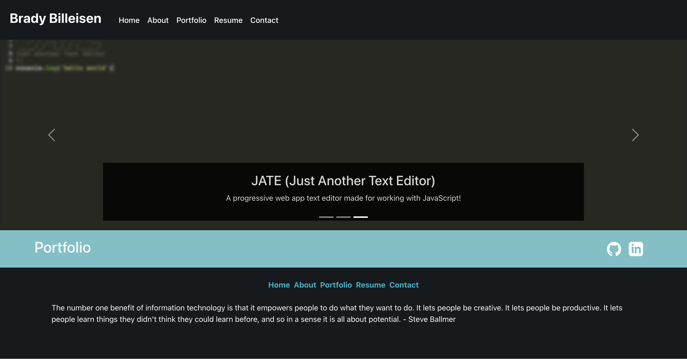
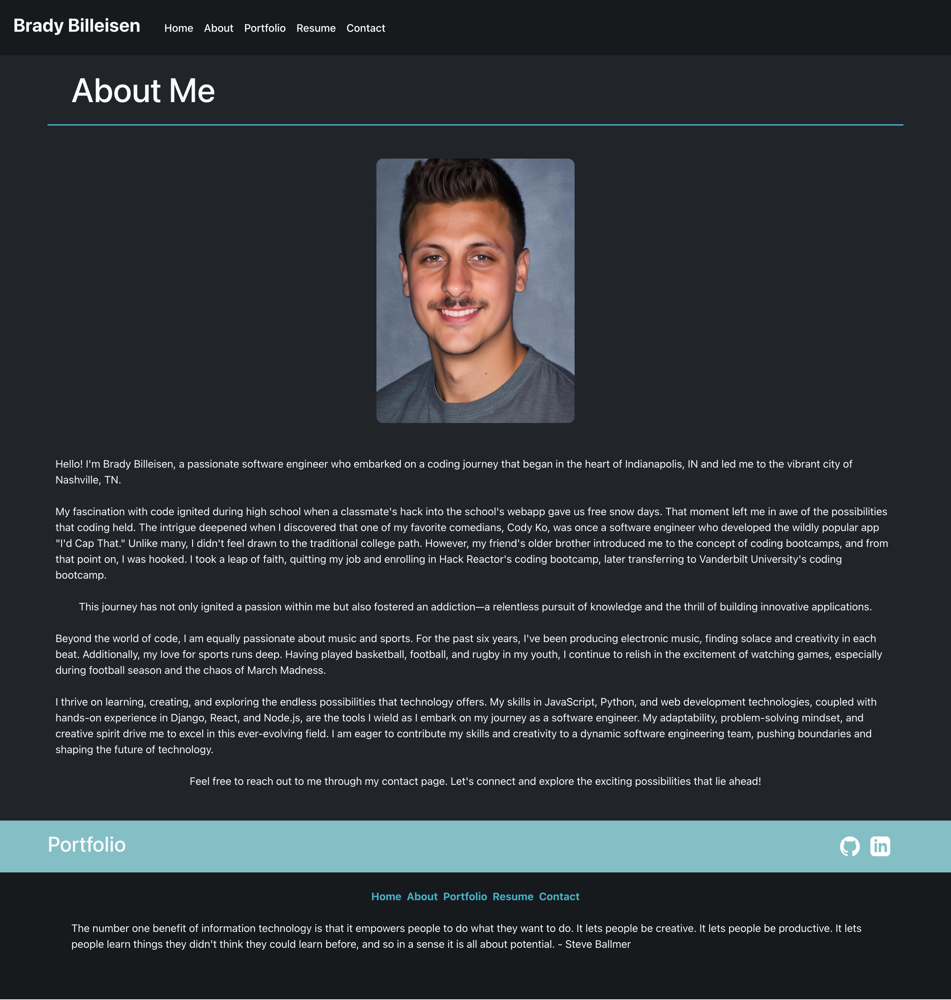
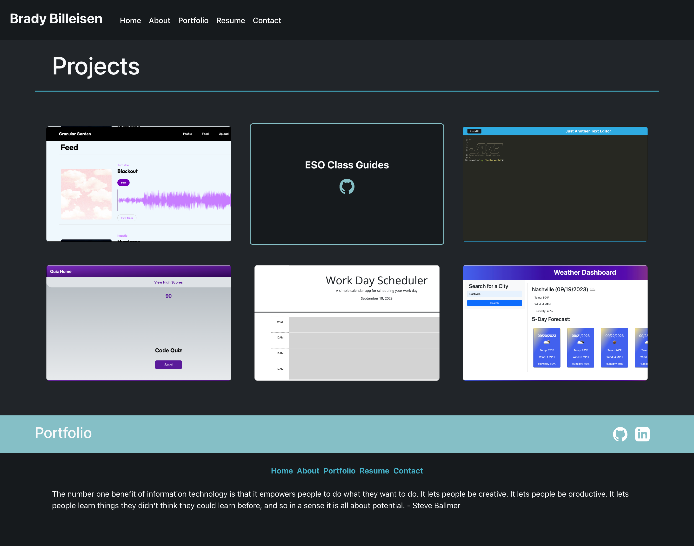
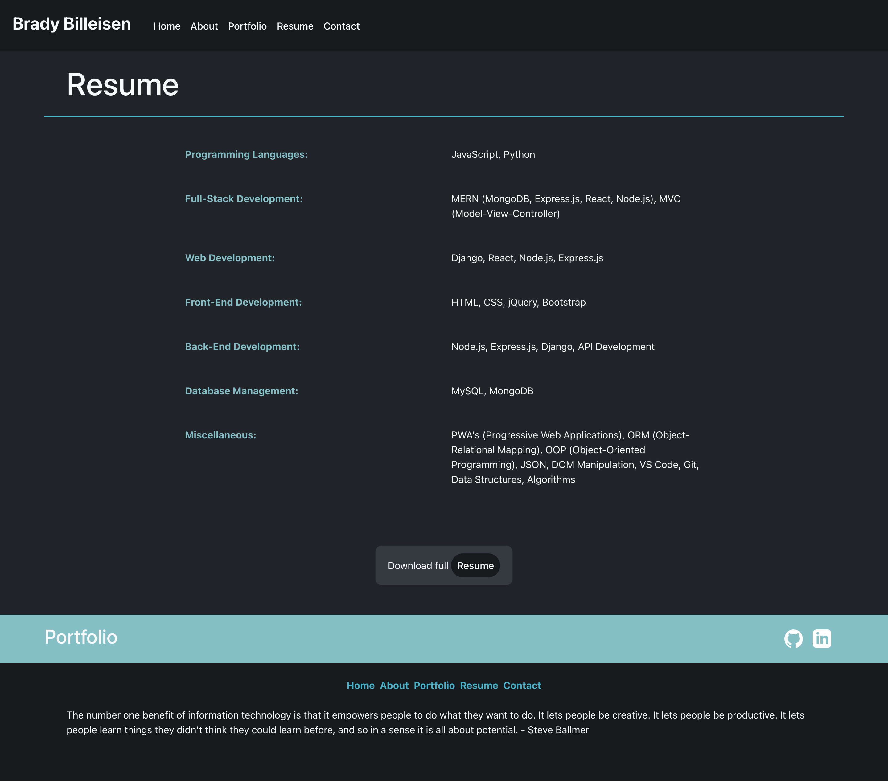
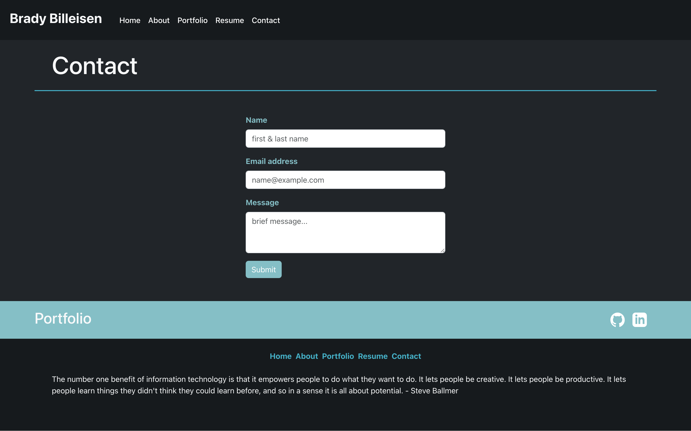

# Brady Billeisens Portfolio
## Description
This is a single-page application portfolio for myself (a web developer). It showcases my skills, projects, and contact information. The portfolio is built using React and React Bootstrap for a responsive and modern user interface. The portfolio is deployed on Netlify.
## Technologies Used
- **React**: The application is built using the React library, which enables the creation of reusable UI components and provides a dynamic and interactive user experience.

- **React Bootstrap**: Bootstrap is used to enhance the styling and layout of the portfolio, making it responsive and visually appealing.

- **React Router**: React Router is used for handling navigation within the portfolio, allowing users to easily switch between different sections of the app.

- **ESLint**: ESLint is used for code linting to ensure code quality and adherence to best practices.
## Usage
- Navigate through the portfolio using the navigation links in the header.
- Explore my projects in the "Portfolio" section, which includes links to both deployed applications and GitHub repositories.
- Contact me using the "Contact" form or LinkedIn, and ensure that all required fields are filled out.
## Visuals

## Questions
If you have any questions about this application feel free to reach out:
- Email: [bradybill32@gmail.com](mailto:bradybill32@gmail.com)

- LinkedIn: [Brady Billeisen](https://www.linkedin.com/in/brady-billeisen)

- GitHub: [Brady Billeisen](https://github.com/brady-billeisen)
## Application
- [Deployed Application](https://bradybilleisenportfolio.netlify.app/)
- [GitHub Repository](https://github.com/brady-billeisen/react-portfolio)
